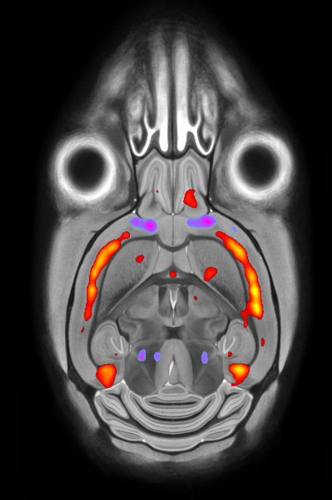

MouseMorph
==========

Tools for MRI mouse brain morphometry.

MouseMorph is a modular set of tools for automatically analysing mouse brain MRI scans and NIfTI images. It enables fully automatic [Voxel- and Tensor-Based Morphometry][ashb_vbm_2000] (VBM, TBM) on large cohorts of high-resolution images. It is employed at the UCL Centre for Advanced Biomedical Imaging (CABI) for [phenotyping](http://en.wikipedia.org/wiki/Phenotype) mice based on *in-vivo* and *ex-vivo* MRI scans. It has been tested for robustness on hundreds of mouse brain scans, both *in vivo* and *ex vivo*.

The primary distinction from clinically-focussed tools like [SPM](http://www.fil.ion.ucl.ac.uk/spm/) and [FSL](http://fsl.fmrib.ox.ac.uk/fsl/fslwiki/) is a robust set of pre-processing steps, unique to -- or with customisations for -- the preclinical paradigm (mice and rats):
- Identification and extraction of multiple subjects from a single scan image
- Orientation to a standard space, from any initial orientation
- Mouse brain extraction (skull stripping / brain masking)
- Tissue segmentation

Most of these steps are atlas-based (requiring prior knowledge). A few mouse atlases, fulfilling this requirement, are freely available to download (see links below). It is our aim to release more. For a further introduction, see the [**poster**][mm_poster]. For a more detailed explanation, see the accompanying paper, [_**Powell, N.M., (2014) Fully-automated high-throughput phenotyping of mouse brains with µMRI, with application to the Tc1 model of Down syndrome**_][mm_paper]. For links to open and free wild-type mouse brain MRI data, see below.

MouseMorph is open-source, cross-platform, and written in Python. It is designed with [NIfTI](http://nifti.nimh.nih.gov/) images in mind. In addition to the code included in this repository, various elements from the corresponding [paper]() are open-source and available on [Figshare]().

Developed at the [UCL Centre for Medical Image Computing (**CMIC**)](http://cmic.cs.ucl.ac.uk/) and the [UCL Centre for Advanced Biomedical Imaging (**CABI**)](http://www.ucl.ac.uk/cabi) by Nick Powell (nicholas.powell.11@ucl.ac.uk) and others.

Paper: [][mm_paper] Poster: [][mm_poster]

## Phenotyping
If you are interested in using MouseMorph to assist a phenotyping study, please get in touch, and see the citation information below.

## Getting Started
1. Set up Python
2. Download and install NiftyReg and NiftySeg
3. Download MouseMorph
4. Download a mouse atlas

## Download wild-type mouse brain data

## Links
- [UCL Centre for Medical Image Computing (CMIC)](http://cmic.cs.ucl.ac.uk/)
- [UCL Centre for Advanced Biomedical Imaging (CABI)](http://www.ucl.ac.uk/cabi)

### CMIC software
- [NiftyReg](http://sourceforge.net/projects/niftyreg/)
- [NiftySeg](http://sourceforge.net/projects/niftyseg/)
- more [Nifty tools](http://cmic.cs.ucl.ac.uk/home/software/)

### Mouse atlases
Multi-subject atlases are preferred.

- [NUS Mouse Atlas (Singapore)](http://www.bioeng.nus.edu.sg/cfa/mouse_atlas.html)
- [MRM NeAt Mouse Atlas (Florida)](http://brainatlas.mbi.ufl.edu/)

Single-subject atlases.

## Citation

## License
MouseMorph is distributed under the [BSD 3-clause license](LICENSE).

© 2014 Nick Powell and [University College London](http://www.ucl.ac.uk/), UK

[mm_paper]: docs/paper.pdf
[im_TBM_example]: docs/ex_mouse_brain_TBM.png
[mm_poster]: docs/Nick_Powell-20131016-MouseMorph_MRI_Mouse_Phenotyping-Poster_A0_portrait.pdf
[ashb_vbm_2000]: http://www.fil.ion.ucl.ac.uk/~karl/Voxel-Based%20Morphometry.pdf "(PDF) Ashburner (2000): Voxel-Based Morphometry --- The Methods"